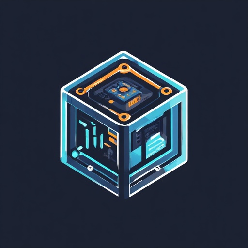

<a id="readme-top"></a>

<!-- PROJECT LOGO -->
<br />
<div align="center">
  <a href="https://github.com/Petar-Yordanov/podrun">
    
  </a>

  <h3 align="center">PodRun</h3>

  <p align="center">
    Pod Run is a low-level container runtime. 
  </p>
</div>

<!-- TABLE OF CONTENTS -->
<details>
  <summary>Table of Contents</summary>
  <ol>
    <li>
      <a href="#about-the-project">About The Project</a>
      <ul>
        <li><a href="#built-with">Built With</a></li>
      </ul>
    </li>
    <li>
      <a href="#getting-started">Getting Started</a>
      <ul>
        <li><a href="#prerequisites">Prerequisites</a></li>
        <li><a href="#installation">Installation</a></li>
      </ul>
    </li>
    <li><a href="#usage">Usage</a></li>
    <li><a href="#roadmap">Roadmap</a></li>
    <li><a href="#license">License</a></li>
  </ol>
</details>


<!-- ABOUT THE PROJECT -->
## About The Project

Pod Run is a low-level, rootful (local) container runtime written in Rust. It focuses on the core container lifecycle, a “minimum viable container feel,” and a small set of practical features (state, logs, listing, and basic resource limits) without trying to be a full orchestration system.

<div align="center">

[](https://github.com/Petar-Yordanov/vmmon/actions/workflows/build.yml)

</div>


<p align="right">(<a href="#readme-top">back to top</a>)</p>

### Built With

* [![Rust][rust-badge]][rust-url]
* [![Linux][linux-badge]][linux-url]
* [![Linux Containers][linuxcontainers-badge]][linuxcontainers-url]
* [![GitHub Actions][gha-badge]][gha-url]

<!-- Badges -->
[rust-badge]: https://img.shields.io/badge/Rust-000000?style=for-the-badge&logo=rust&logoColor=white
[rust-url]: https://www.rust-lang.org/

[linux-badge]: https://img.shields.io/badge/Linux-FCC624?style=for-the-badge&logo=linux&logoColor=black
[linux-url]: https://www.kernel.org/

[linuxcontainers-badge]: https://img.shields.io/badge/Linux%20Containers-333333?style=for-the-badge&logo=linuxcontainers&logoColor=white
[linuxcontainers-url]: https://linuxcontainers.org/

[gha-badge]: https://img.shields.io/badge/GitHub%20Actions-2088FF?style=for-the-badge&logo=githubactions&logoColor=white
[gha-url]: https://github.com/features/actions

<p align="right">(<a href="#readme-top">back to top</a>)</p>

<!-- GETTING STARTED -->
## Getting Started

Pod Run is a rootful, local container runtime. You’ll build the podrun binary, prepare a rootfs (recommended via Docker export), then run create/start/exec/wait/kill/delete with sudo.

### Prerequisites

- Linux host with:
    - Rust (stable) toolchain + Cargo
    - Docker (used only to fetch/export a rootfs for testing/quick-start)
    - sudo access (Pod Run is currently rootful)
    - Kernel features enabled for namespaces + cgroups v2 (for limits)

* Essentials setup on Ubuntu/Debian
  ```sh
    sudo apt-get update
    sudo apt-get install -y --no-install-recommends \
    ca-certificates curl \
    docker.io \
    build-essential
  ```

* Install Rust
  ```sh
    curl --proto '=https' --tlsv1.2 -sSf https://sh.rustup.rs | sh
    source "$HOME/.cargo/env"
    rustup toolchain install stable
    rustup default stable
  ```

### Installation

1. Clone the repo
   ```sh
   git clone git@github.com:Petar-Yordanov/podrun.git
   ```
2. Build
   ```sh
   # Debug
   cargo build --all-targets --all-features

   # RElease
   cargo build --release --all-features
   ```
3. Create a rootfs via Docker export
   ```js
    ROOTFS=/tmp/podrun-rootfs
    rm -rf "$ROOTFS"
    mkdir -p "$ROOTFS"

    docker pull ubuntu:24.04
    cid=$(docker create ubuntu:24.04)
    docker export "$cid" | sudo tar -C "$ROOTFS" -xf -
    docker rm "$cid"

    test -f "$ROOTFS/etc/os-release"
   ```

<p align="right">(<a href="#readme-top">back to top</a>)</p>

<!-- USAGE EXAMPLES -->
## Usage

Below are the basic lifecycle commands. Note: Pod Run is rootful, so it requires sudo.

Create -> Start -> Exec -> Kill -> Delete
```sh
BIN=./target/debug/podrun
ROOTFS=/tmp/podrun-rootfs

# Create a container named "e1" that runs sleep as init
sudo "$BIN" create e1 --rootfs "$ROOTFS" -- /usr/bin/sleep 1000000

# Start init in new namespaces
sudo "$BIN" start e1

# Exec a command inside the container (exit code is propagated)
sudo "$BIN" exec e1 -- /usr/bin/head -n 2 /etc/os-release

# Exec with env and cwd
sudo "$BIN" exec e1 --env FOO=bar --cwd /tmp -- /usr/bin/sh -c 'pwd; echo $FOO; /usr/bin/ls -la'

# Stop the container (signal init)
sudo "$BIN" kill e1

# Remove container metadata from the store
sudo "$BIN" delete e1
```

Wait for init to exit
```sh
BIN=./target/debug/podrun
ROOTFS=/tmp/podrun-rootfs

sudo "$BIN" create w1 --rootfs "$ROOTFS" -- /usr/bin/sleep 1
sudo "$BIN" start w1
sudo "$BIN" wait w1
sudo "$BIN" delete w1
```

<p align="right">(<a href="#readme-top">back to top</a>)</p>

## Roadmap

### Core lifecycle (local, rootful)
- [x] `create` - validates, writes spec.json + state.json
- [x] `open` - loads both spec and state
- [x] `start` - spawns init in new namespaces, updates state
- [x] `exec` - chroot to /proc/<pid>/root, runs command, returns exit code
- [x] `wait` - polls until init PID disappears, updates state
- [x] `kill` - signals PID to exit
- [x] `delete` - remove container metadata

### Minimum container feel
- [x] Mount namespace + `pivot_root` into `rootfs`
- [x] UTS namespace (hostname)
- [ ] Better `/dev` (devtmpfs + devpts so shells/tools behave)
- [ ] PID namespace

### Observability
- [ ] `state` - show status + pid + timestamps (and verify pid is alive)
- [ ] `list` - list containers from the store
- [ ] `logs` - capture init stdout/stderr to file
- [ ] `logs -f` - follow logs (tail)

### Limits
- [ ] cgroups v2: `pids.max`
- [ ] cgroups v2: `memory.max`

<p align="right">(<a href="#readme-top">back to top</a>)</p>

<!-- LICENSE -->
## License

Distributed under the MIT License. See `LICENSE.md` for details.

<p align="right">(<a href="#readme-top">back to top</a>)</p>
